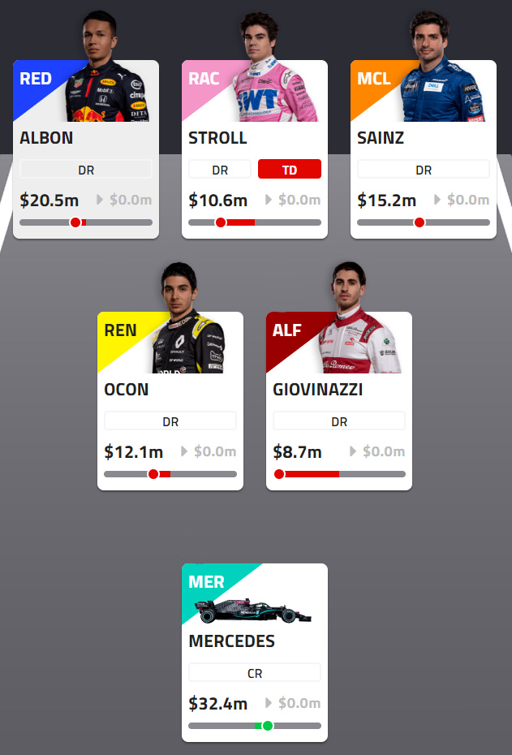
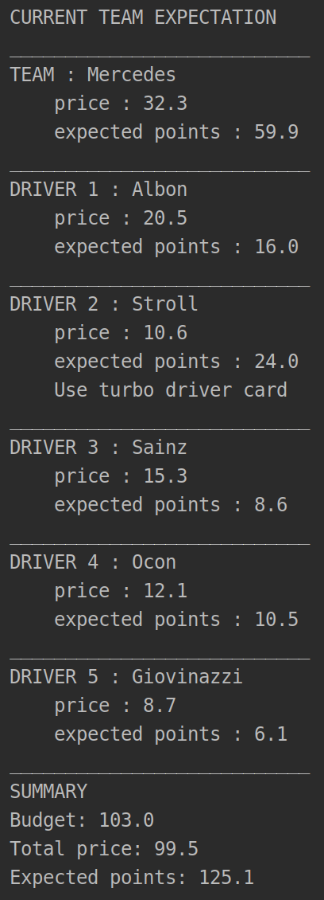
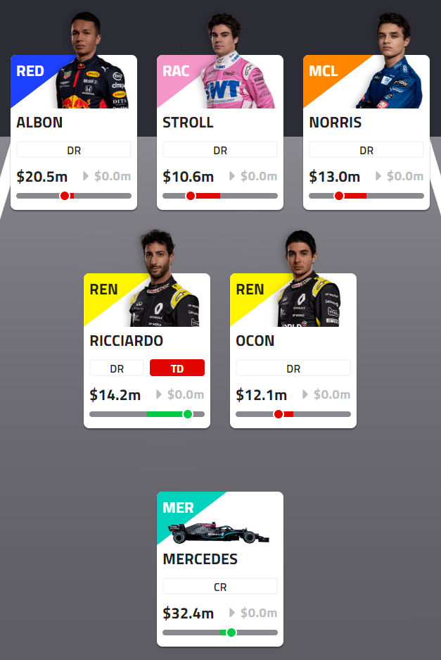
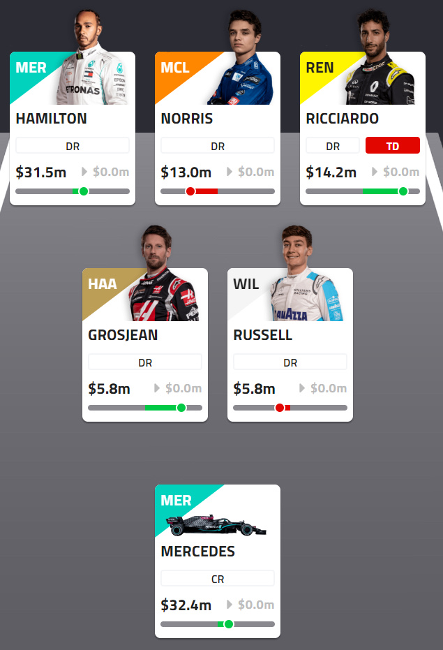
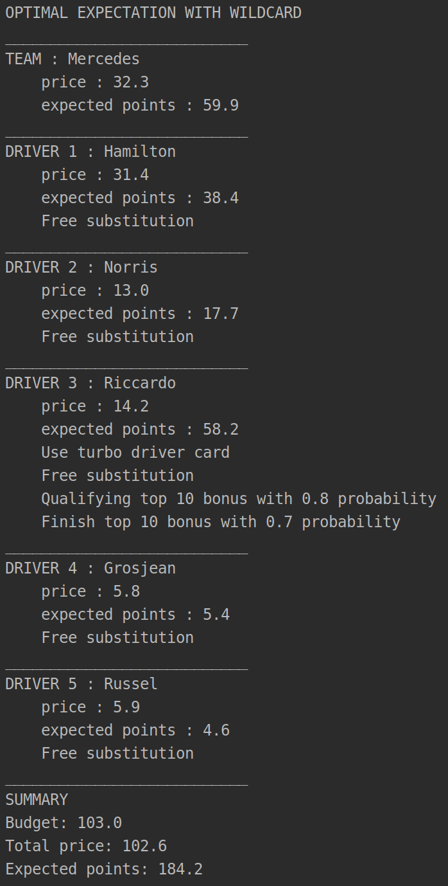

# 🏎 F1 Fantasy Helper

Every year during the formula 1 season, many of the fans partake in a game of [fantasy](https://fantasy.formula1.com) to see who can make th best predictions.
This program uses integer linear programming and statistics from previous races of the season to maximize the expectation of points and returns the best team to do so.
The results of the analysis can help the player pick the best team, advice you on when to trade which drivers, and witch driver to play special cards (See the rules of the game) on. I would also like to note that the optimal calculations are based on expectations and cannot take into account unpredictible events such as crashes in the next race. It is still very much luck based after all. But this program can help make better decision from past statistics for the current team and budget that you have.

## Rules of the game

### 📃 Picking your team

The player starts with a budget of 100m. The player must pick a team consisting of 1 car constructor and 5 drivers. Each drivers and car constructor have a price based on their performance in the last Formula 1 season.

Here is an example team 

<p align="center">
  
</p>

### 💨 Turbo Driver

Each week, you can select **one** driver below the price of 20m to be your Turbo Driver (TD). The points that this driver will earn will be doubled for this race week. This card can be moved to any of your drivers for free each week. However, if the driver does not finish the race and loses points, the lost points are also doubled which is a risk to think about.

### ♻ Substitutions

Each week, the player can decide to trade drivers and car constructor. One substitution is free each week. However, additional substitution will cost 10 points each. 

### 🃏 Wildcard

The player only has two wildcard play throughout the season. One in the first half, and one in the second half. When playing the wildcard, the player can make as many substitutions they like for free before the next race.

### 📈 Dynamic Pricing

<p align="center">
  
</p>

Each week, all substitutions are aggregated and price changes are applied to the drivers and constructors. When many players wand to trade a certain driver onto their team, their price increases. Same goes for price decrease.

## Point System

### Qualifying

- **1pt** Did not progress to Q2
- **2pts** Progressed to Q2 but did not progress to Q3
- **3pts** Progressed to Q3
- **2pts** Qualified ahead of teammate (driver only)
- **-5pts** Did not qualify (driver only)
- **-10pts** Disqualification from qualifying (driver only)

Qualifying Position Bonuses:

**10pts** pole, **9pts** 2nd, **8pts** 3rd, **7pts** 4th, **6pts** 5th, **5pts** 6th, **4pts** 7th, **3pts** 8th, **2pts** 9th, **1pt** 10th

### Race
- **1pt** Finished race
- **3pts** Finished ahead of teammate (driver only)
- **2pts** Finished race, position gained (per place gained, max. +10 pts)
- **5pts** Fastest lap (driver only)
- **-2pts** Started race within Top 10, finished race but lost position (per place lost, max. -10 pts)
- **-1pt** Started race outside Top 10, finished race but lost position (per place lost, max. -5 pts)
- **-15pts** Does not finish (driver only)
- **-20pts** Disqualification from race (driver only)

Race Finish Bonuses:

**25pts** 1st, **18pts** 2nd, **15pts** 3rd, **12pts** 4th, **10pts** 5th, **8pts** 6th, **6pts** 7th, **4pts** 8th, **2pts** 9th, **1pt** 10th

### Streaks

- **5pts** Driver Qualifying - driver qualifies in Top 10 for 5 races in a row
- **10pts** Driver Race - driver finishes race in Top 10 for 5 races in a row
- **5pts** Constructor Qualifying - both drivers qualify in Top 10 for 3 races in a row
- **10pts** Constructor Race - both drivers finish race in Top 10 for 3 races in a row

<p align="center">
  
</p>

These streaks are very important to think about when substituting drivers. If a driver that is not in the players team is about to reach both the qualifying and race finish streaks, it might be worth it to pay a substitution penalty of 10 points to get this driver onto the team. This way, with the TD card, this driver could potentially rack up an additional 30 points on top of the regular points that it will get from the regular scoring. In the above picture, we can see that Riccardo is about to reach both streaks (indicated by the Q and R counters where he has 4/5). Riccardo has been pretty consistent in finishing in the top 10 and will likely achieve the streak. This is a good trade, which also has potential to increase your total budget as many people will want him on their team, his price is likely to increase lots this race week.

## How the Helper Program Works

The helper program does not use any fancy machine learning to try to predict the outcome of the next race. There simply isn’t enough data to do so! Furthermore, the situations in which a driver does not finish the race are very unpredictable. For example, the driver could be mixed up in a crash that was not their fault at all, their car could have encountered mechanical problems, etc... Data from previous years is also not the most reliable as the drivers could have been driving for a different team or a different car from the same team which has a huge impact on their performance.

Instead, what the program does is that it uses the data accumulated in the season so far and makes the ***assumption*** that the drivers will continue to perform similarly on average. It performs a ***fancy*** version of the knapsack problem that maximises their expected points that they will score next race, with the player's total budget as the limiting factor.

The program considers the drivers that you currently have in your team. This way even if other drivers are very attractive and could increase your expected points for the next race, it takes into account that the player might need to pay some substitution penalties and gives the best course of action based on all information.

### Expected Points for the next race

````
expected_points = (total_points_scored - points_from_streaks) / number_of_races

if (about_to_win_qualy_streak)
    expected_points += (number_races_qualified_top10 / number_of_races) * 5
    
if (about_to_win_finish_streak)
    expected_points += (number_races_finish_top10 / number_of_races) * 5
    
if (turbo_driver)
    expected_points *= 2
    
if (substitution)
    expected_points - 10
````

1. We first calculate average of points that the driver scores each race ommiting all points that come from streak bonuses
2. If the driver is about to score a qualifying streak, we add 5 points weighed by the percentage of races where they made top 10 in qualifying
3. If the driver is about to score a race finish streak, we add 10 points weighed by the percentage of races where they made top 10
4. If the driver was selected as the turbo driver, its points are doubled
5. If the driver was a non free substitution, the penalty of 10 points applied

# Example

Here is an example of the program suggesting team changes after Sochi 2020. The program will calculate the best course of action based on the current team that you have as well as your budget. This isn't necessarily the perfect team, and the program will give you different suggestions if you had a different team composition and a different budget.

### Current Team

Let's assume we have a budget of 103m and this is our current team.

<p align="center">
  
  
</p>

We are using a 99.5m out of out 103m budget and our expected points for the next race are 125.1 points

### Optimize team without Wildcard

This team is the optimal team that we can have for the next race without a wildcard. The team would now be using 102.7m out of 103m which is most of our budget. The expected points increase from 125.1 to 164.3.

<p align="center">
  
  
</p>

Here, the program recognized that Riccardo has been on a streak both in qualifying and in top10 finishes and is about to cash in bonus points. The program therefore suggests a substitution of Giovinazzi (8.7m) with Ricardo (14.2m). However, to make this substitution fit into the budget, we need to also substitute Sainz (15.3m) with Norris (13m). Norris has more expected points for the next race than Sainz but making this second substitution will cost a 10 points penalty. The great number of points that Riccardo is expected to make with its streak bonuses especially with the Turbo Driver card does make it worthwhile.

### Optimize the team with Wildcard

This team is the optimal team that we can have that fits in our 103m budget for the next race using our wildcard. The price of this new team is 102.6m which is again using our budget more efficiently. The expected point this time go up to 184.2 which is much higher than without using a wildcard (164.3). In situations like this, it might be worth it to use the wildcard.

<p align="center">
  
  
</p>

This time, since all substitutions are free, the program suggests a drastic change in the team composition. The program does however still recognize that Riccardo is a must have for the next race and boosts its points using the Turbo Driver card.
